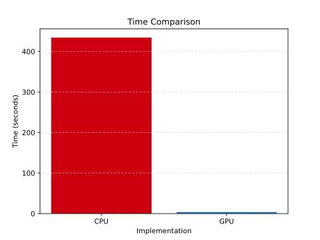

# CUDA_Miller_Rabin_library

CUDA library with minimal dependencies and ease of use implementing deterministic Miller-Rabin primality test for uint_64. The test is optimized for testing wide ranges of numbers on GPU.

This library aims to efficiently parallelize the deterministic Miller-Rabin primality test over multiple numbers simultaneously, not to implement the quickest Miller-Rabin to test a single integer. So in order to achieve maximal efficiency, use as huge arrays as possible.

## Benchmark

This implementation tested all primes in unsigned int 32 range (203 million primes) in 3 seconds on Nvidia RTX 3090. As a comparison, I run a highly optimized CPU version of the Miller-Rabin test from the [GNU MP library](https://gmplib.org/) with the same number of iterations on the same test set with Intel(R) Core(TM) i7-10700K, see evaluated [benchmark notebook](/benchmark/benchmark.ipynb) for detailed info or run your own.

## How to run

- Example usage - Check the [Example code snippet](example_run/example.cpp) and the [prepared run script](example_run/run_example.sh).
- Tests - This repository includes several tests. Run the [test script](tests/runtest.sh) to execute them.
- Benchmark - Run the [benchmark notebook](/benchmark/benchmark.ipynb) to obtain a performance boost on your hardware.
